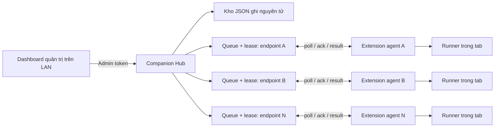

# Kế hoạch hoàn thiện MVP — Web Action Recorder v4

> Nguồn chuẩn của kế hoạch này là mã trong checked-out repository root.
> Cập nhật lần cuối: 2026-07-12.

## 1. Kết luận rà soát

Mã hiện tại là một prototype có thể tiếp tục phát triển, chưa phải MVP sẵn sàng sử dụng lâu dài.

Đã có:

- Extension MV3, side panel, cửa sổ editor độc lập và vùng canvas thay đổi chiều cao.
- Node editor có kéo node, zoom/pan, cổng nối, dây SVG và các node điều kiện.
- Picker có danh sách ứng viên, xem trước khung, nút Chấp nhận/Hủy và bảng có thể kéo.
- Runner click/type/navigate/condition/log, tiếp tục sau điều hướng trong cùng tab ở mức cơ bản.
- Companion HTTP có bearer token, IP allowlist và hàng đợi lệnh đơn giản.
- Kiểm tra cú pháp qua; 3 unit test hiện tại đều qua.

Chưa đạt MVP vì:

- Chưa có kiểm thử tự động cho editor, picker, runner, navigation và companion.
- Dây nối và thao tác kéo chưa có bảo đảm tính đúng đắn/persistence; render dây đang dựng lại toàn bộ SVG trong mỗi `mousemove`.
- Picker và hoạt ảnh con trỏ đọc layout/ghi style liên tục; chưa có giới hạn theo frame và chưa có test chống rò listener/overlay.
- Runner chưa có run context chuẩn, input động, retry, timeout thống nhất, trạng thái bền vững hoặc xử lý lỗi mạng/tab đầy đủ.
- Companion dùng một FIFO chung; máy bất kỳ có thể lấy lệnh của máy khác và lệnh bị mất ngay khi được lấy khỏi queue.
- Chưa có device identity, heartbeat, per-device queue, lease/ack, batch, dataset, dashboard hay persistence.
- Tài liệu hiện tại mô tả LAN không thống nhất với mã đã có.

## 2. Phạm vi MVP đã chốt

MVP hoàn thành khi đáp ứng đồng thời bốn nhóm sau.

### 2.1 Editor và chọn đích

- Kéo dây hoặc chọn cổng nguồn/đích đều tạo đúng liên kết.
- Dây vẫn hiển thị sau khi thả, lưu, đóng/mở editor và reload extension.
- Vùng bấm cổng tối thiểu 28×28 px; có trạng thái hover, selected, connected và bàn phím.
- Canvas chạy được ở side panel và cửa sổ độc lập; chiều cao được lưu riêng cho từng chế độ.
- Picker đưa ra danh sách ứng viên hợp lý gần điểm bấm, ưu tiên control tương tác và phần tử có nhãn ổn định.
- Chọn một ứng viên chỉ xem trước; chỉ nút Chấp nhận mới ghi selector.
- Bảng ứng viên kéo được, không ra ngoài viewport; Escape/Hủy luôn dọn sạch overlay/listener.
- Viền con trỏ/đích luôn có độ tương phản cao và tự cập nhật khi scroll/resize.

### 2.2 Runner cục bộ

- Chạy graph theo thứ tự xác định, hỗ trợ click, type, navigate, switchTab, log, condition, OR, AND và IFS trong phạm vi đã kiểm thử.
- Dừng đúng khi người dùng bấm Stop, khi tab đóng, selector timeout hoặc graph không hợp lệ.
- Tiếp tục sau điều hướng mà không chạy trùng bước hoặc báo hoàn thành sớm.
- Input bước `type` hỗ trợ biến `{{field}}`; dữ liệu nhạy cảm không xuất hiện trong log.
- Trước khi chạy phải validate graph: ID trùng, link treo, node không tới được, cycle không được khai báo, selector/URL sai.
- Mỗi run có trạng thái: `queued`, `running`, `waiting_navigation`, `succeeded`, `failed`, `cancelled`.

### 2.3 Điều khiển LAN nhiều extension/máy

- Một Companion Hub điều khiển ít nhất 10 endpoint extension trong mạng tin cậy.
- Mỗi extension installation có `deviceId` ổn định, tên máy/endpoint, nhóm và token riêng.
- Chạy cùng profile trên nhiều máy; chạy profile/inputs khác nhau theo từng máy.
- Hỗ trợ chạy đồng thời có giới hạn và chạy luân phiên với delay cấu hình được.
- Hỗ trợ input chung, input theo thiết bị, danh sách ngẫu nhiên có/không cho trùng, và mapping hàng dữ liệu → thiết bị.
- Theo dõi trạng thái từng command, kết quả từng endpoint và dừng batch/toàn bộ.
- Restart Companion không làm mất thiết bị, batch, command đang chờ và kết quả đã ghi.

### 2.4 Bảo mật và vận hành

- Mặc định chỉ bind `127.0.0.1`; LAN là opt-in rõ ràng.
- Tách admin token, enrollment token và device token; token không được ghi vào log.
- IP allowlist, giới hạn payload, rate limit, timeout và validation mọi request.
- Không hỗ trợ arbitrary JavaScript, shell command, đọc cookie hay xuất raw DOM từ xa.
- Chỉ profile bật `enabled` mới nhận lệnh từ Companion.
- Có nút emergency stop và audit log đã redaction.
- LAN HTTP chỉ dùng trong mạng tin cậy; khuyến nghị Tailscale/VPN. Public Internet nằm ngoài MVP.

## 3. Kiến trúc mục tiêu

Quyết định để giữ MVP gọn: app điều khiển là một web dashboard do chính Companion Hub phục vụ, không làm Electron/native desktop app riêng ở giai đoạn này. Như vậy chỉ cần một tiến trình Node trên máy điều khiển, các máy khác trong LAN mở dashboard bằng trình duyệt, giảm một lớp cài đặt, auto-update và lỗi IPC.



Không dùng WebSocket cho extension trong MVP. Polling có backoff phù hợp MV3, dễ kiểm thử và phục hồi hơn. Dashboard có thể poll trạng thái 1–2 giây/lần; nâng cấp SSE/WebSocket chỉ sau MVP.

Kho dữ liệu MVP dùng JSON snapshot với hàng ghi tuần tự, ghi file tạm rồi rename. Lớp persistence phải có interface riêng để có thể đổi sang SQLite sau này mà không sửa scheduler/API.

Cấu trúc file dự kiến để tránh quyết định lại khi triển khai:

```text
companion/
  index.js             # đọc config và listen
  server.js            # createServer, route dispatch
  auth.js              # role/token/IP/rate limit
  store.js             # interface + JSON atomic store
  scheduler.js         # batch, assignment, lease/retry
  public/              # dashboard HTML/CSS/JS thuần
src/
  shared.js            # schema dùng chung, không phụ thuộc chrome/DOM
  graph.js             # validate/execute graph logic thuần
  template.js          # {{field}} + redaction helpers
  service-worker.js    # orchestration, device agent, tab lifecycle
  content-script.js    # DOM adapter, picker, page actions
ui/
  canvas-editor.js     # editor + link renderer
test/
  unit/                # logic thuần
  integration/         # companion + persistence + API
  fixtures/            # trang web/profile/dataset cố định
```

Giữ Node built-in test runner. Chỉ chọn một công cụ browser E2E trong Giai đoạn 0 sau khi xác nhận Chrome/Edge cài trên máy; không thêm đồng thời Playwright và Puppeteer. Không thêm production dependency nếu Node built-in đáp ứng được.

## 4. Mô hình dữ liệu tối thiểu

### Device

- `id`, `name`, `groupIds`, `tokenHash`, `createdAt`.
- `lastSeenAt`, `status`, `extensionVersion`, `browser`, `capabilities`.
- `profiles`: chỉ metadata `id`, `name`, `enabled`, `updatedAt/hash`.

### Command

- `id`, `batchId`, `deviceId`, `type`, `profileId`, `inputs`.
- `status`, `attempt`, `maxAttempts`, `createdAt`, `notBefore`, `expiresAt`.
- `leaseId`, `leaseUntil`, `startedAt`, `completedAt`, `result`, `error`.

Luồng trạng thái chuẩn:

`queued → leased → running → succeeded | failed | cancelled`

Nếu lease hết hạn mà chưa ack/result, command trở lại `queued` cho đến `maxAttempts`. `leaseId` và command ID giúp POST kết quả có tính idempotent, không tạo kết quả trùng.

### Batch

- `id`, `name`, `targetDeviceIds/groupIds`, `profileId` hoặc `profileByDevice`.
- `assignmentMode`: `same`, `per_device`, `random_pool`, `mapping`.
- `concurrency`, `delayMs`, `stopOnError`, `createdAt`, `status`.
- `datasetId`, `allowDuplicate`, `seed`, thống kê queued/running/success/failed.

### Dataset

- Danh sách record dạng object, ví dụ `{ "account": "a", "text": "b" }`.
- `same`: một record dùng chung.
- `per_device`: map `deviceId → record`.
- `random_pool`, cho trùng: chọn theo seed và có thể lặp.
- `random_pool`, không trùng: shuffle theo seed rồi cấp phát; từ chối tạo batch nếu không đủ record.
- `mapping`: cột `deviceKey` hoặc khóa do người dùng chọn ánh xạ chính xác record với endpoint.

Trong profile, bước nhập dùng `{{account}}`, `{{text}}`... Runner chỉ nhận record đã được Companion gán cho chính endpoint đó.

## 5. API MVP

### Device API

- `POST /v1/devices/enroll`: enrollment token → cấp device token một lần.
- `POST /v1/devices/register`: cập nhật tên, nhóm, version, capabilities và profile metadata.
- `POST /v1/devices/heartbeat`: cập nhật online/run state.
- `GET /v1/devices/:deviceId/commands/next`: lease một command đúng device.
- `POST /v1/devices/:deviceId/commands/:commandId/ack`: xác nhận đã nhận/chạy.
- `POST /v1/devices/:deviceId/commands/:commandId/result`: ghi kết quả idempotent.

### Admin API

- `GET /v1/devices`: danh sách online/offline và profile khả dụng.
- `POST /v1/batches`: validate, gán dataset và tạo command.
- `GET /v1/batches/:id`: trạng thái/tổng hợp kết quả.
- `POST /v1/batches/:id/stop`: hủy command chưa chạy và gửi stop cho run đang chạy.
- `GET /v1/commands/:id`: chi tiết command đã redaction.
- `GET/POST /v1/datasets`: quản lý dataset có giới hạn kích thước.
- `GET /health`: health không chứa dữ liệu nhạy cảm.

Mọi route `/v1/*` phải xác định rõ role `admin` hoặc `device`; không dùng một token chung cho tất cả role.

## 6. Thứ tự triển khai bắt buộc

Không bắt đầu dashboard/multi-device trước khi Gate 2 hoàn thành. Điều khiển từ xa chỉ khuếch đại lỗi editor/runner nếu lõi chưa ổn định.

### Giai đoạn 0 — Đóng baseline và dựng hàng rào kiểm thử

Mục tiêu: mọi sửa đổi sau này có cách phát hiện regression.

Công việc:

1. Chọn đúng thư mục Downloads làm source of truth; không sửa song song bản OneDrive rỗng.
2. Ghi version/build ID và lưu một profile fixture đại diện cho graph thẳng, if/else và navigation.
3. Tách logic thuần khỏi DOM/chrome API ở mức cần thiết: graph validation, assignment, template resolver.
4. Thêm script `test:unit`, `test:integration`, `test:all`; giữ `npm run check`.
5. Tạo fixture web cục bộ gồm button, input, select, dynamic DOM, navigation và fake password.
6. Chụp baseline hiệu năng: 20/50/100 node, số link, thời gian render/link update và số listener sau picker cancel.

Kiểm thử bắt buộc:

- Unit schema/graph/template/redaction.
- Smoke manifest và syntax.
- Baseline hiện tại được ghi rõ Pass/Fail; không coi 3 test hiện tại là đủ.

Gate 0:

- `npm run check` và `npm run test:unit` xanh.
- Có fixture và báo cáo baseline lặp lại được.

### Giai đoạn 1 — Ổn định editor, dây nối và picker

Mục tiêu: giải quyết toàn bộ lỗi thao tác trực tiếp người dùng đã báo.

Công việc editor:

1. Chuẩn hóa Pointer Events; một state machine duy nhất cho `idle`, `drag_node`, `drag_link`, `pan`.
2. Dùng `setPointerCapture`; xác định port đích bằng `elementsFromPoint` khi pointerup, không phụ thuộc duy nhất vào `event.target` của `window`.
3. Tăng hit area cổng, hỗ trợ click-source/click-destination và Enter/Space; Escape hủy.
4. Tách graph data khỏi SVG DOM; chỉ commit link sau khi validate nguồn/đích.
5. Không gọi `getData()` làm side effect để đồng bộ link. Dùng hàm `syncGraphFromLinks()` rõ ràng và autosave debounce.
6. Render dây bằng `requestAnimationFrame`; cache element/geometry trong một frame; không clear/rebuild toàn bộ SVG trong mỗi mousemove.
7. Dùng `ResizeObserver` và một lần redraw sau resize/zoom/pan/render node.
8. Hiển thị trạng thái link lỗi; không âm thầm bỏ qua khi port hoặc node không tồn tại.
9. Lưu `ui.x/y`, link và canvas height; reload phải tái tạo đúng.

Công việc picker/con trỏ:

1. Chỉ cho phép một picker session; mở session mới phải cleanup session cũ.
2. Cleanup idempotent cho accept, cancel, Escape, tab unload và runtime disconnect.
3. Bọc hover-box update trong `requestAnimationFrame`; một frame chỉ đọc rect một lần rồi ghi style một lần.
4. Candidate ranking: interactive/label/role/data-testid/id trước, container/text chung sau; loại extension overlay.
5. Mỗi ứng viên có nhãn, selector, loại phần tử và lý do ưu tiên; click chỉ preview.
6. Bảng kéo bằng pointer capture, giới hạn viewport; không đọc `offsetWidth/height` liên tục khi kéo.
7. Viền target dùng outline hai lớp tương phản, không transition width/height; cập nhật khi scroll/resize.

Kiểm thử bắt buộc:

- Unit graph-link conversion và candidate ranking.
- DOM test: connect bằng drag, connect bằng click/keyboard, cancel, duplicate connection, delete, reload.
- Picker mở/hủy 50 lần không tăng listener/overlay.
- Performance fixture 100 node/150 link: kéo node không có long task lặp lại trên 100 ms; thao tác vẫn phản hồi được.

Gate 1:

- Tất cả lỗi dây nối, cổng nhỏ, nút chọn đích, cửa sổ độc lập, resize canvas, bảng kéo và mất viền đều có case test Pass.
- Không còn render SVG toàn bộ theo tần suất raw `mousemove`.

### Giai đoạn 2 — Ổn định graph runner và input động

Mục tiêu: runner cục bộ đáng tin cậy trước khi nhận lệnh LAN.

Công việc:

1. Tạo `RunContext`: runId, profile snapshot, inputs, current step, visited path, tab/window, abort state, timestamps.
2. Tách graph executor khỏi content-script DOM adapter để unit test được.
3. Quy định rõ semantics OR/AND/IFS; AND không tự chạy nhiều nhánh song song nếu profile không khai báo parallel.
4. Validate graph trước run; chặn root rỗng, link treo, cycle ngoài policy và step không hỗ trợ.
5. Template resolver chỉ thay `{{key}}`; báo lỗi biến thiếu, không dùng `eval`.
6. Chuẩn hóa input cho React/Vue/native setter và event `input/change`; bổ sung select/checkbox nếu đưa vào MVP.
7. Navigation continuation lưu đầy đủ run context và chỉ resume sau content script sẵn sàng.
8. `switchTab` phải await kết quả background và chuyển run context sang tab đích hoặc fail rõ ràng.
9. Dùng `AbortController`/abort flag cho wait/delay; Stop phải ngắt selector observer và timer.
10. Log structured, bounded, redacted; trạng thái cuối chỉ ghi một lần.

Kiểm thử bắt buộc:

- Unit executor cho graph thẳng, if/else, OR/AND/IFS, cycle, stop, missing variable.
- Integration trên fixture: click/type/select/dynamic selector/navigation/tab switch.
- Reload/navigation không chạy trùng và không báo success khi một step đã fail.

Gate 2:

- 50 lần chạy lặp profile fixture không có run treo hoặc kết quả trùng.
- Stop phản hồi trong tối đa 1 giây với step đang wait/delay.
- Input động và redaction đều Pass.

### Giai đoạn 3 — Companion Hub nền tảng an toàn

Mục tiêu: thay queue toàn cục bằng server có thể kiểm thử và phục hồi.

Công việc:

1. Refactor `companion/server.js` thành `createServer(config, store)`; chỉ `listen()` ở entry point.
2. Thêm router, validation và error model thống nhất, giới hạn body 64 KB mặc định.
3. Tạo persistence interface và JSON atomic store; serialized write để tránh file hỏng.
4. Thêm device enrollment/register/heartbeat, token hash và lastSeen.
5. Per-device queue với lease/ack/retry/expiry/idempotent result.
6. Poll endpoint chỉ trả lệnh đúng token/device; chống một endpoint nhận lệnh máy khác.
7. Exponential backoff + jitter phía extension khi server offline; reset backoff khi kết nối lại.
8. Không log Authorization, inputs nhạy cảm hoặc raw token.

Kiểm thử bắt buộc:

- Server chạy trên port ngẫu nhiên trong test.
- 401 token sai, 403 IP sai, payload quá lớn, JSON sai, route/role sai.
- Hai device không lấy nhầm queue.
- Lease timeout requeue; result gửi lặp không tạo bản ghi lặp.
- Restart server phục hồi queue/result từ store.

Gate 3:

- Hai extension giả lập polling đồng thời 30 phút không mất/nhầm/nhân đôi command.
- Default localhost và LAN opt-in được test tự động.

### Giai đoạn 4 — Batch scheduler, dataset và dashboard LAN

Mục tiêu: hoàn thiện chức năng điều khiển nhiều máy theo yêu cầu.

Công việc scheduler:

1. Chọn target theo device hoặc group, loại endpoint offline/không có profile theo policy hiển thị rõ.
2. Tạo batch transaction: validate toàn bộ trước, sau đó mới enqueue.
3. `same`: cùng profile và record cho tất cả.
4. `per_device`: từng device có profile/record riêng.
5. `random_pool`: seed cố định để có thể tái hiện; toggle cho phép trùng.
6. `mapping`: preview trước ánh xạ A → B/device; báo hàng thiếu/thừa/trùng khóa.
7. Concurrency limit, delay giữa lượt, round-robin và stopOnError.
8. Stop batch tạo cancel command cho run đã dispatch và hủy command còn queued.

Công việc dashboard:

1. Trang đăng nhập bằng admin token trong session memory; không lưu token vào URL/localStorage.
2. Bảng endpoint có online/offline, group, version, profile và run hiện tại.
3. Chọn nhiều endpoint, mode chạy, profile, concurrency, delay và stopOnError.
4. Nhập/paste JSON hoặc CSV nhỏ; preview và validate trước khi chạy.
5. Toggle trùng/không trùng; xem trước record được cấp cho từng endpoint.
6. Theo dõi batch và lỗi từng máy; nút stop batch/emergency stop.
7. UI cập nhật bằng polling có backoff; không render lại toàn trang mỗi nhịp.

Kiểm thử bắt buộc:

- Assignment deterministic theo seed.
- Không trùng tuyệt đối khi toggle tắt; thiếu record phải fail trước enqueue.
- Mapping đúng từng endpoint; CSV/JSON lỗi không tạo batch nửa chừng.
- Concurrency không vượt cấu hình; round-robin giữ đúng thứ tự.
- Dashboard keyboard-accessible và không lộ token trong DOM/log/history.

Gate 4:

- Demo 3 endpoint: chạy giống nhau, khác inputs, luân phiên, random không trùng và mapping đều Pass.
- Soak 10 endpoint × 100 command không mất, nhầm hoặc nhân đôi kết quả.

### Giai đoạn 5 — Hardening, đóng gói và phát hành MVP

Mục tiêu: bản có thể cài và vận hành lặp lại trên máy khác.

Công việc:

1. Rà permission manifest; ghi rõ lý do `<all_urls>` hoặc chuyển sang optional permissions nếu khả thi trong MVP.
2. Rate limit admin/device riêng; lockout ngắn khi auth fail lặp lại.
3. Enrollment token một lần hoặc có TTL; rotation/revoke device token.
4. Cấu hình firewall/Tailscale mẫu; cảnh báo khi bind `0.0.0.0`.
5. Backup/restore store, migration schemaVersion và xử lý file hỏng có bản backup.
6. Bounded logs/dataset/result; cleanup theo retention.
7. Viết hướng dẫn cài extension, chạy companion, enroll endpoint, tạo batch, khôi phục lỗi.
8. Đóng gói companion kèm script start; không hardcode token.
9. Chạy test Chrome và Edge bằng profile sạch; ghi build/version và known limitations.

Gate 5 — MVP Exit:

- `npm run check` và toàn bộ unit/integration/E2E đã định nghĩa đều Pass.
- Không còn bug P0/P1; bug P2 còn lại phải được ghi trong Known limitations.
- Cài mới, enroll, chạy batch và restart companion được thực hiện theo tài liệu mà không sửa code.
- Security checklist và recovery test đều Pass.

## 7. Thứ tự ưu tiên lỗi

| Mức | Ý nghĩa | Ví dụ trong dự án |
|---|---|---|
| P0 | Mất dữ liệu, chạy sai máy, lộ token/secret, không thể dừng | Queue toàn cục phát lệnh nhầm endpoint; kết quả/input lộ log |
| P1 | Chức năng MVP chính không dùng được | Dây không lưu/hiện; picker không accept; navigation chạy trùng |
| P2 | Chậm, khó thao tác nhưng có đường vòng | Hit area nhỏ; kéo node giật; chooser lệch viewport |
| P3 | Thẩm mỹ/tài liệu | Nhãn, spacing, nội dung hướng dẫn |

Mỗi giai đoạn chỉ sửa bug thuộc phạm vi đó, ngoại trừ P0 luôn được xử lý ngay.

## 8. Ngân sách hiệu năng

Đây là UI DOM/SVG chạy trên main thread, không phải pipeline xử lý ảnh GPU. Chỉ tối ưu sau khi có số đo.

- Hover/picker và drag: tối đa một cập nhật DOM mỗi animation frame.
- Không xen kẽ nhiều lần `getBoundingClientRect()` và ghi style trong cùng vòng lặp.
- Không clear/rebuild toàn bộ link layer khi chỉ một node di chuyển; cập nhật các link liên quan.
- Poll extension khi idle: mặc định 2 giây; khi lỗi dùng backoff 2 → 5 → 10 → 30 giây có jitter.
- Heartbeat: 10–15 giây; trạng thái offline sau 3 heartbeat bị lỡ.
- Dashboard: refresh 1–2 giây khi có batch active, 5–10 giây khi idle.
- Log/persistence write phải được batch/debounce; không ghi file cho mỗi pointer event/heartbeat.

Chỉ số được ghi cùng cấu hình máy/browser; không dùng phần trăm CPU/GPU chung làm tiêu chí duy nhất.

## 9. Ma trận kiểm thử tối thiểu

| Lớp | Phạm vi | Chạy khi nào |
|---|---|---|
| Syntax/schema | Toàn bộ JS, manifest, profile import | Mỗi patch |
| Unit | Graph, template, assignment, scheduler, auth helpers | Mỗi patch liên quan |
| DOM component | Editor/picker trên fixture | Cuối Giai đoạn 1 và regression |
| Server integration | API, store, lease, retry, restart | Mỗi patch Companion |
| Extension integration | Chrome API stub + runner/content script | Cuối Giai đoạn 2–4 |
| Manual E2E | Chrome + Edge unpacked, 3 endpoint LAN | Mỗi Gate và release |
| Performance/soak | 100 node/150 link; 10 endpoint × 100 command | Gate 1, 3, 4, 5 |
| Security | Auth/role/IP/rate limit/redaction/rotation | Gate 3 và 5 |

Không chấp nhận “test pass” nếu chỉ chạy 3 unit test cũ.

## 10. Rủi ro chính và cách khóa lỗi

- Graph UI và runner hiểu link khác nhau: dùng chung graph model/validator và fixture vàng.
- Command bị mất do polling: lease + ack + retry + idempotency.
- Nhiều endpoint dùng cùng ID/token: ID sinh một lần mỗi installation; enrollment cấp token riêng.
- Random không trùng nhưng thiếu dữ liệu: validate cardinality trước khi tạo batch.
- Navigation làm mất context: session persistence có schema/version và resume handshake.
- Stop không ngắt observer/timer: mọi wait nhận abort signal và có cleanup test.
- Main thread giật: rAF batching, cache geometry, benchmark trước/sau.
- Store JSON hỏng khi mất điện: temp file + atomic rename + backup snapshot + serialized writer.
- LAN token bị nghe lén: mặc định localhost; LAN chỉ mạng tin cậy/Tailscale; không public Internet.
- Phạm vi phình quá lớn: mọi tính năng ngoài mục 2 đưa vào backlog sau MVP.

## 11. Quy trình làm việc tiết kiệm token

1. Mỗi lượt chỉ thực hiện một work package/Gate nhỏ, thường 2–6 file liên quan.
2. Đầu lượt chỉ đọc `PROJECT_STATE.md`, mục hiện tại trong tài liệu này và các file sẽ sửa; không review lại toàn repo.
3. Trước khi sửa, ghi test tái hiện hoặc tiêu chí đo cụ thể. Sau patch chạy test hẹp trước, `npm run check`/full test sau.
4. Không đổi kiến trúc giữa giai đoạn nếu không có lỗi P0 hoặc bằng chứng đo đạc.
5. Cuối mỗi lượt cập nhật `PROJECT_STATE.md`: hoàn thành gì, file nào đổi, test nào Pass/Fail, việc kế tiếp duy nhất.
6. Dùng fixture và JSON request mẫu lưu trong repo thay vì mô tả lại dài trong chat.
7. Không gửi lại toàn bộ file trong câu trả lời; chỉ nêu kết quả, test và link dòng/file quan trọng.
8. Gom các sửa cơ học cùng loại; không trộn refactor lớn với tính năng mới trong một patch.
9. Chỉ mở rộng test matrix khi có behavior mới hoặc bug regression thật.
10. Nếu Gate fail, sửa đến khi xanh trước khi chuyển giai đoạn.

Mẫu yêu cầu cho lượt triển khai tiếp theo:

> Thực hiện Giai đoạn 0 trong `docs/MVP_COMPLETION_PLAN.md`. Chỉ làm đúng phạm vi giai đoạn, viết test trước cho logic thuần, chạy check/test, rồi cập nhật `PROJECT_STATE.md`. Không bắt đầu Giai đoạn 1.

## 12. Backlog sau MVP

- Public cloud relay, điều khiển qua Internet công cộng.
- Arbitrary JavaScript/shell/remote DOM console.
- Đồng bộ secret hoặc credential vault.
- WebSocket extension, streaming log thời gian thực.
- Workflow parallel phức tạp, loop tùy ý, distributed transaction.
- OCR, computer vision, xử lý ảnh/GPU hoặc điều khiển theo pixel.
- RBAC nhiều admin, SSO và multi-tenant.
